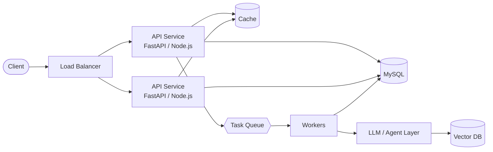

**I build backend systems that stay fast under load, and AI layers that don't block the request path.**

---

## About

Second-year CS undergraduate focused on the point where **backend engineering meets applied AI**. I care less about demos and more about what happens after: latency, throughput, failure modes, and cost.

- **Principle:** make it work, make it measurable, make it scale.
- **Approach:** stateless services, caching, async workers, and LLM calls kept behind a queue.
- **Direction:** production-grade agent pipelines, retrieval systems, and LLM serving.
- **Looking for:** AI/ML and Software Engineering internships where I can ship real systems and learn from strong engineers.

---

## System Design Philosophy

> Slow, non-deterministic work (LLM inference, retrieval, tool calls) runs off the hot path. The API stays predictable; the AI layer scales independently.

---

## Tech Stack

**Languages & Backend**

**AI / ML**

**Infrastructure & Tooling**

**Frontend (when the system needs a face)**

**Currently exploring**

---

## Focus Areas

| Area | What I'm working on |
|---|---|
| **Backend Engineering** | REST APIs, auth, data modeling, clean service boundaries |
| **System Design** | Caching, load balancing, queues, consistency vs. availability trade-offs |
| **Agentic AI** | Multi-agent workflows with tool use, memory, and reasoning loops |
| **LLM Infrastructure** | RAG pipelines, vector search, fine-tuning, serving models behind APIs |
| **MCP & Tool Use** | Connecting LLMs to real-world tools via Model Context Protocol |

---

## Featured Projects

<table>
<tr>
<td width="50%" valign="top">

### Agentic RAG Pipeline
Retrieval-augmented generation with multi-step reasoning, tool calling, and memory, served through an async API.

- Chunking strategy and vector search tuned for retrieval quality
- Agent loop with tool use and conversational memory
- Async FastAPI layer for non-blocking inference

`Python` `LangChain` `FastAPI` `Vector DB`

**[View repo →](https://github.com/SKhunmeer)**

</td>
<td width="50%" valign="top">

### Multi-Agent Workflow System
Specialized agents that delegate and collaborate on complex tasks through a graph-based orchestrator.

- State-machine design for predictable agent control flow
- Tool orchestration across agents
- Containerized for reproducible deployment

`Python` `LangGraph` `Docker`

**[View repo →](https://github.com/SKhunmeer)**

</td>
</tr>
<tr>
<td width="50%" valign="top">

### AI-Powered Full Stack App
React + Node.js application with an LLM backend: real-time chat, document Q&A, and summarization.

- API gateway pattern between client and model layer
- Streaming responses for low perceived latency
- Structured request handling and error paths

`React` `Node.js` `OpenAI`

**[View repo →](https://github.com/SKhunmeer)**

</td>
<td width="50%" valign="top">

### Transformer Fine-Tuning Lab
Experiments fine-tuning open-source LLMs on domain data using parameter-efficient methods.

- LoRA / QLoRA to fit training on limited GPU memory
- Evaluation against baseline models
- Reproducible training setup

`PyTorch` `HuggingFace` `CUDA`

**[View repo →](https://github.com/SKhunmeer)**

</td>
</tr>
</table>

---

## Currently

- **Building:** agent pipelines and retrieval systems with production-style APIs
- **Learning:** distributed caching, message queues, database internals, observability
- **Next up:** cloud deployment and MLOps

**Learning log**

- [x] REST API design and service structure
- [x] RAG pipelines and agent loops
- [ ] Distributed caching and message queues
- [ ] Database indexing, replication, and sharding
- [ ] Observability: logging, metrics, tracing
- [ ] Cloud deployment and MLOps

---

## GitHub Stats

 

---

## Let's Connect

I'm actively looking for **AI/ML and Backend internships**. If you're building something where latency, scale, and LLMs intersect, I'd like to talk.

  

